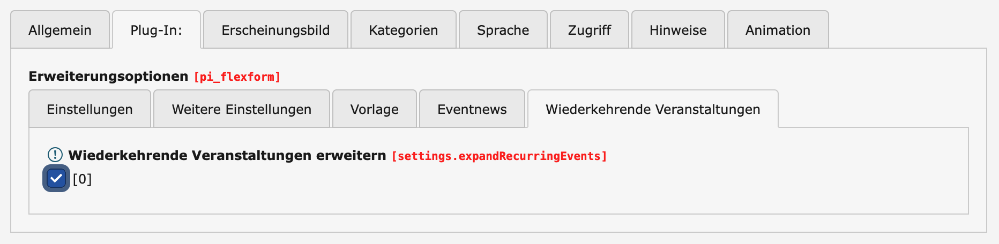
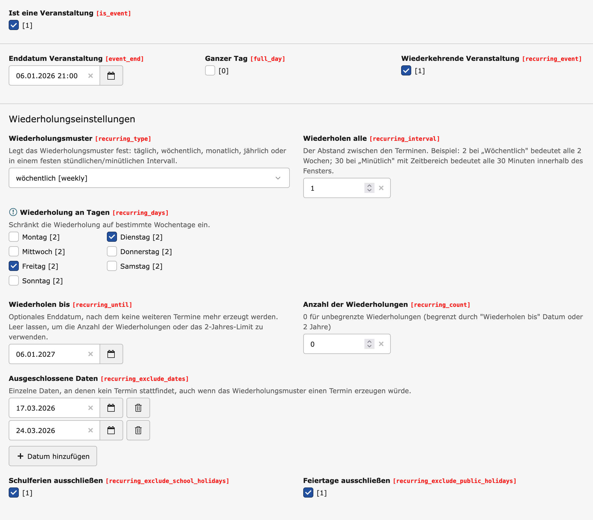

# TYPO3 Extension: Recurring Events for News

A TYPO3 extension that adds recurring event functionality to `EXT:news` and `EXT:eventnews`. Generate event occurrences dynamically based on recurrence rules (RFC 5545) without creating duplicate database records.

## Description

This extension extends Georg Ringer's excellent [news](https://github.com/georgringer/news) and [eventnews](https://github.com/georgringer/eventnews) extensions with powerful recurring event capabilities. Events can repeat on various schedules with full support for:

- **Recurrence types:** minutely, hourly, daily, weekly, monthly, yearly
- **Multiple weekday selection** (e.g., every Monday and Friday)
- **Monthly weekday mode** (e.g., every 3rd Tuesday, last Friday of the month)
- **Time windows for hourly/minutely events** (e.g., every 30 minutes between 08:00–12:00 and 16:00–22:00)
- **Date exclusions** – manually exclude individual dates via a custom date picker
- **School holiday exclusion** – skip occurrences during school holidays (via ICS URL)
- **Public holiday exclusion** – skip occurrences on public holidays (via ICS URL)
- **End date or occurrence count limits**
- **RFC 5545 compliant iCalendar export** with `RRULE`, `EXDATE`, and per-slot `VEVENT` entries
- **Timezone-aware date calculations**
- **Dynamic occurrence generation** without database bloat

Built on top of the robust [php-rrule](https://github.com/rlanvin/php-rrule) library by Rémi Lanvin, ensuring standards-compliant recurrence rule processing.

## Requirements

- TYPO3 13.x
- EXT:news (`georgringer/news`)
- EXT:eventnews (`georgringer/eventnews`)

## Installation

1. Install via Composer:
```bash
composer require spielerj/eventnews-recurring
```

2. Update the database schema:
   - **Backend:** Maintenance → Analyze Database Structure
   - **CLI:**
```bash
vendor/bin/typo3 database:updateschema
```

3. Clear all caches

## Configuration

### Holiday ICS URLs (Site Settings)

School and public holiday calendars are configured per site via TYPO3 Site Settings. Navigate to **Sites → Edit Site → Eventnews Recurring → Holiday Calendars** and enter one or more ICS URLs (e.g. from `ferien-api.de` or the official Ferientermine portal):

| Setting | Description |
|---|---|
| `eventnewsRecurring.schoolHolidaysIcsPaths` | ICS URLs for school holiday calendars |
| `eventnewsRecurring.publicHolidaysIcsPaths` | ICS URLs for public holiday calendars |

The ICS files are fetched and cached. Any `DATE`-type entries (full-day entries) are used as the exclusion basis — no `RRULE` parsing required, making it compatible with standard German holiday ICS feeds.

### Plugin Setting: Expand Recurring Events

For recurring events to appear as individual occurrences in **list views**, you must enable the option in the news plugin:

Navigate to the **news plugin** (content element) → **Tab "Plug-In"** → **"Recurring Events"** and check **"Expand recurring events"** (`settings.expandRecurringEvents`).



Without this checkbox, only the original event record is listed — the individual recurrence dates are not expanded.

## Backend Fields

| Field | Description |
|---|---|
| Recurring event | Enable recurring mode |
| Recurrence type | minutely / hourly / daily / weekly / monthly / yearly |
| Interval | Repeat every N units (e.g. every 2 weeks) |
| Monthly repeat mode | Fixed date **or** Nth weekday (1st–4th, last) |
| Weekday | Weekday for monthly weekday mode |
| Days of week | Weekday filter for daily/weekly/hourly/minutely |
| Time windows | Time ranges for hourly/minutely events |
| End date | Stop recurring after this date |
| Max occurrences | Stop recurring after N occurrences |
| Exclude dates | Manually excluded individual dates |
| Exclude school holidays | Skip occurrences during school holidays |
| Exclude public holidays | Skip occurrences on public holidays |


*Backend view of a recurring event with weekly recurrence pattern*

## Usage

### RruleViewHelper

The extension includes a flexible ViewHelper to output recurrence information in different formats.

Register the namespace in your template:

```html
<html xmlns:enr="Spielerj\EventnewsRecurring\ViewHelpers"
      data-namespace-typo3-fluid="true">
```

**Human-readable text** (for detail pages):
```html
<enr:rrule event="{newsItem}" format="text" />
```
Examples:
- `"Wöchentlich, montags und freitags"`
- `"Monatlich, außer am 17.03.2026, außer in den Schulferien"`
- `"Jeden 3. Dienstag im Monat"`
- `"Alle 30 Minuten, mittwochs, zwischen 08:00 und 12:00 Uhr"`

**RFC 5545 RRULE string** (for iCalendar export):
```html
<enr:rrule event="{newsItem}" format="rfc" />
```
Output: `RRULE:FREQ=WEEKLY;BYDAY=MO,FR`

**Date timestamps** (for JavaScript calendars):
```html
<enr:rrule event="{newsItem}" format="dates" />
```
Output: JSON array of Unix timestamps

### IcsVeventsViewHelper

For hourly/minutely events with time windows, use this ViewHelper to generate individual `VEVENT` blocks in an `.ics` template:

```html
<enr:icsVevents event="{newsItem}" domain="example.com" />
```

Each time slot becomes a separate `VEVENT` with its own `DTSTART`, `DTEND`, and a shared `RRULE`. Excluded dates are emitted as `EXDATE` lines.

### IcsExdatesViewHelper

Required in `.ics` templates to output all `EXDATE` lines for a recurring event. Covers both manually excluded dates **and** days excluded via school/public holiday ICS feeds. Without this ViewHelper, holiday exclusions will not appear in the exported calendar file.

```html
<enr:icsExdates event="{newsItem}" />
```

Place it inside the `VEVENT` block, after the `RRULE` line:

```
RRULE:FREQ=WEEKLY;UNTIL=...;BYDAY=TU
<enr:icsExdates event="{newsItem}" />
END:VEVENT
```

Each excluded date is rendered as a separate `EXDATE` line. Full-day events use `EXDATE;VALUE=DATE:YYYYMMDD`, timed events use `EXDATE:YYYYMMDDTHHmmss`. Dates beyond the `RRULE` `UNTIL` date are automatically omitted.

## Credits

**Georg Ringer** ([@georgringer](https://github.com/georgringer)) - For the outstanding news and eventnews extensions.  
**Rémi Lanvin** ([@rlanvin](https://github.com/rlanvin)) - For the excellent php-rrule library.  
Developed for ([Ahlene Medien](https://www.ahlene.de/))

## License

GPL-2.0-or-later
